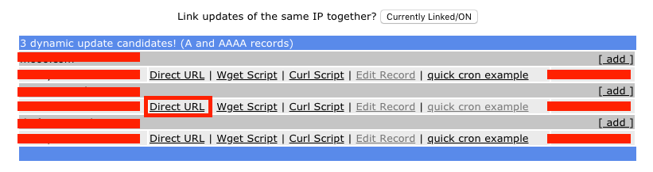

# FreeDNS Updater

This image update your domains of freedns automatically every 5 minutes

* [GitHub Project](https://github.com/OscarSotoSanchez/FreeDNS-Updater)
* [Docker Image](https://hub.docker.com/r/oscarsotosanchez/freedns-updater/)

## Compile image 🚀

For compile this image first download project, then move to project path and exec the next command

```
docker build -t name-image .
```

Replace **name-image** for your preferred image name


### How use this image 📋

This image need only one file, this file also contains the tokens of your pages.

You can obtain your token here:




**For Example:**
`https://freedns.afraid.org/dynamic/update.php?blablabla1232blabu`

***blablabla1232blabu*** is my token, now we'll make a file like this:

```
# Token my first page 
blablabla1232blabu

#Token my secont page
blebleble62133blublu
```

In this file the text followed by **#** is interpreted like a comment and is not evaluated. The tokens must be written in separated lines. This file must be named **freedns_tokens**. In other case it will not work.<a name="run-docker"></a>

### Run docker 🛠️

For run this image you have two options, mount file with tokens and the output of the logins will be written in the docker image or mount a folder with the file with tokens. This method allows you to view logs in the folder of your local machine.

*The folder that contains the logs in the docker is `/var/tmp/freedns`, and the file with logs is `/var/tmp/freedns_pages.log`*

**Mount only the file with tokens**

```
docker run --name dns-updater -v your-path/freedns_tokens:/var/tmp/freedns/freedns_tokens -d name-image
```

**path/freedns_tokens** is the file with tokens
**dns-updater** is the name of the container
**name-image** is the name asigned in the past

For the see logs with this method we must be enter in the container. First find the id of the image with command `docker ps` and later exec `docker exec -it id /bin/sh` this command open a terminal, in this terminal write `cat /var/tmp/freedns_pages.log`

**Mount folder with the file with tokens**
```
docker run --name dns-updater -v your-path:/var/tmp/freedns -d name-image
```
**path** is the path of folder
**dns-updater** is the name of the container
**name-image** is the name asigned in the past

For the previous logs seen with this method you only need to go to your machine folder.


## Use docker hub image  📦

If you prefer, you can use my image stated above in the docker hub. [oscarsotosanchez/freedns-updater](https://hub.docker.com/r/oscarsotosanchez/freedns-updater/).

The execution is [like stated above](#run-docker), but the image uses changed methods. Now we are going to view examples.

**Mount only the file with tokens**

```
docker run --name dns-updater -v your-path/freedns_tokens:/var/tmp/freedns/freedns_tokens -d oscarsotosanchez/freedns-updater
```

**Mount folder with the file with tokens**
```
docker run --name dns-updater -v your-path:/var/tmp/freedns -d oscarsotosanchez/freedns-updater
```


## Links ✒️
* [My GitHub](https://github.com/oscarsotosanchez)
* [My Docker Hub](https://hub.docker.com/r/oscarsotosanchez/)